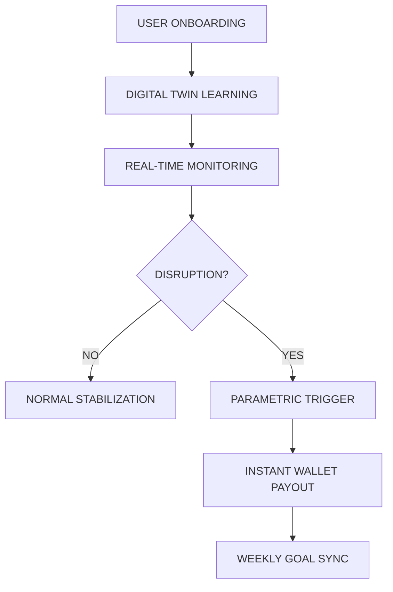

  
  
   

  
  
   
  
  <h3>ADAPTIVE INCOME INTELLIGENCE</h3>
   
  
<strong>Predict. Prevent. Stabilize.</strong>

  
  

    <a href="#inspiration">Inspiration</a> • 
    <a href="#what-it-does">What it does</a> • 
    <a href="#system-workflow">Workflow</a> • 
    <a href="#parametric-triggers">Triggers</a> • 
    <a href="#tech-architecture">Architecture</a>
  

  
  

   

> [!IMPORTANT]
> **SYSTEM STATUS: OPTIMIZING**
> The Intelligence Engine is currently simulating 4.2k active geofences in the Chennai-Bangalore corridor.

---

## Inspiration

IncomeOS was born from witnessing the extreme, unmanaged volatility of the Indian gig economy. Every day, millions of workers like **Ravi** gamble their livelihoods against unpredictable monsoons, heatwaves, and demand crashes. We realized that while insurance exists for physical assets, there was no "intelligence layer" for the most critical asset: **daily income.** We set out to build a system that moves beyond reactive compensation into proactive stabilization.

---

## What it does

IncomeOS is a predictive stability engine designed to maintain a consistent income baseline for gig workers. It uses a **Digital Twin Simulation** to track expected earnings against real-world atmospheric and systemic disruptions. 
*   **Predicts**: Analyzes weather patterns and zone demand before the shift starts.
*   **Prevents**: Suggests "shaded hubs" or peak-profit zones to avoid known bottlenecks.
*   **Stabilizes**: Triggers instant parametric payouts when external variables (like rain or app downtime) hit predefined thresholds.

---

## How we built it

We engineered a HUD-style "Operating System" aesthetic using a high-performance modern tech stack:
*   **Next.js 15 (App Router)**: The core framework for the real-time dashboard.
*   **Framer Motion**: HUD-like animations and fluid transitions.
*   **Recharts**: Custom-themed visualizers for the Income Twin Flow.
*   **Tailwind CSS**: Minimalist, cinematic design system with glassmorphism.
*   **SVG Logic**: Custom animated nodes and sparklines for parametric visualization.

---

## 1. The Problem

**Income Instability**
Gig economy workers face extreme volatility. Earnings are not guaranteed. Every hour is a gamble against variables outside their control.

---

## 2. The Shift in Thinking

**From Reactive to Predictive**
Traditional systems wait for a loss to happen. IncomeOS identifies the risk before it manifest. We don't just insure; we stabilize the system itself.

**Income as a Controllable System**
We treat a worker’s daily run as a data-driven operation. By viewing income through the lens of a **Digital Twin**, we transform unpredictable risk into a managed, intelligent flow.

| FEATURE | TRADITIONAL | INCOMEOS |
| :--- | :--- | :--- |
| **Logic** | Reactive (Loss-based) | **Predictive (Data-based)** |
| **Speed** | 3 - 30 Days Payout | **Instant Parametric Trigger** |
| **Intelligence** | None | **Real-time Digital Twin Simulation** |
| **Goal** | Compensation | **Prevention + Stability** |

---

## 3. Workforce Intelligence

### **RAVI | DELIVERY PARTNER | CHENNAI S3**
Ravi navigates one of the most volatile urban climates. Heatwaves and monsoons directly dictate his survival.

<b>PROTOCOL: RAINFALL DETECTED</b>

 
Trigger: >5mm/hr in Central Zone. Ravi stops for safety. Stablizer auto-compensates ₹240 gap instantly to his wallet.

<b>PROTOCOL: HEATWAVE INDEX</b>

 
Trigger: Temperature >42.0 C. Productivity drops. Shift recommendation pushed to Ravi for shaded "Profit Clusters".

---

## 4. System Workflow

  

---

## 5. Weekly Premium Model

**Dynamic Stability Subscription**
IncomeOS operates on a weekly parametric model. Instead of fixed monthly costs, the subscription is as adaptive as the work.

**Base Weekly Premium**
A minimal entry fee to keep the Intelligence Engine active.

**Dynamic Risk Adjustment**
*   **Location Risk**: Higher in flood-prone or high-traffic zones.
*   **Weather Probability**: Adjusted based on 7-day meteorological forecasts.

---

## 6. Parametric Triggers

**Automated Logic Execution**

**Environmental**
*   **Rainfall**: >5mm/hr in active geofence.
*   **Heat Index**: Sustained >40 C.

---

## 7. AI/ML Integration

### **Income Digital Twin**

A real-time shadow simulation of your earning potential. Using historical data and current demand, it calculates exactly what you *should* be earning every minute.

---

## 8. Fraud Detection System

**System Integrity Protection**

**Geospatial Validation**
Cross-referencing worker GPS data with active order heatmaps. If a worker is "inactive" but in a zone with high confirmed successful deliveries by others, the trigger is flagged.

**Cross-Verification**
Validating environmental triggers (like rain) against a cluster of workers in the same 500m radius.

---

## 9. Tech Architecture

  

---

## 10. Earnings Optimization Index

  

Our AI-driven stability core (OS Core v1) assigns a **Stability Index** score based on consistency.
*   **Threshold A (Balanced)**: Higher stability correlates to lower premiums.
*   **Threshold B (High-Volatile)**: Aggressive stabilization for peak-surge zones.

---

## 11. System Integrity & Security

**Parametric Transparency**
All triggers are based on publicly verified data streams (e.g., global weather nodes, platform API status). There are no subjective humans in the decision loop.

---

## 12. Regional Scalability Protocol

IncomeOS scales parametrically to any urban landscape:
*   **Chennai/Bangalore**: Flood and heatwave triggers prioritized.
*   **Delhi/NCR**: AQI and pollution-based protection blocks.

---

## Challenges we ran into

One of the biggest hurdles was defining a **Universal Stability Index**. Earning volatility isn't linear; 10 minutes of heavy rain can disrupt a 4-hour shift in ways that are hard to model mathematically. We had to iterate on a parametric trigger system that felt "fair" to both the worker and the sustainability of the stabilization pool, eventually landing on a threshold-based activation model.

---

## Accomplishments that we're proud of

We successfully built a **HUD (Heads-Up Display) experience** that feels less like a banking app and more like a flight instrument for your career. The integration of the **Digital Twin Flow**—where a worker can visually see their "Expected" vs "Real-Time" earnings path—is a major milestone in humanizing gig-economy data.

---

## What we learned

Building IncomeOS taught us that **prevention is often more valuable than payout.** While the parametric payouts provide the ultimate fallback, the "Preventive Intelligence" (moving workers to safer or more productive zones before the storm hits) proved to be the more transformative feature for long-term worker health and efficiency.

---

## Product Differentiation

**Not Insurance. Intelligence.**
Traditional insurance wants you to fail so they can pay. IncomeOS wants you to succeed so we can stabilize.

**Not Reactive. Predictive.**
We don't wait for your bank account to hit zero. We see the rain coming and move you—or pay you—before it happens.

---

## Development Plan (6 Weeks)

**Phase 1: Foundation (Current)**
*   Architecture blueprint and Core UI system.
*   High-end dark dashboard and Income Flow visualization.
*   Basic parametric logic.

**Phase 2: Integration**
*   Live weather API hookups (OpenWeather / WeatherStack).
*   Dynamic premium calculation engine (Brier Score calibration).

**Phase 3: Optimization**
*   Advanced Fraud detection (GPS cluster analysis).
*   Instant wallet payouts (UPI/Razorpay integration).

---

## What's next for IncomeOS

*   **Multi-City Expansion**: Tailoring the parametric triggers for Delhi (AQI filters) and Mumbai (High-tide alerts).
*   **Platform Direct Sync**: Direct API integrations with major delivery and ride-hailing platforms to automate fraud detection.

---

   
  
  
<em>"IncomeOS transforms uncertainty into a controlled, intelligent system."</em>

  

  
Income Continuity Platform

