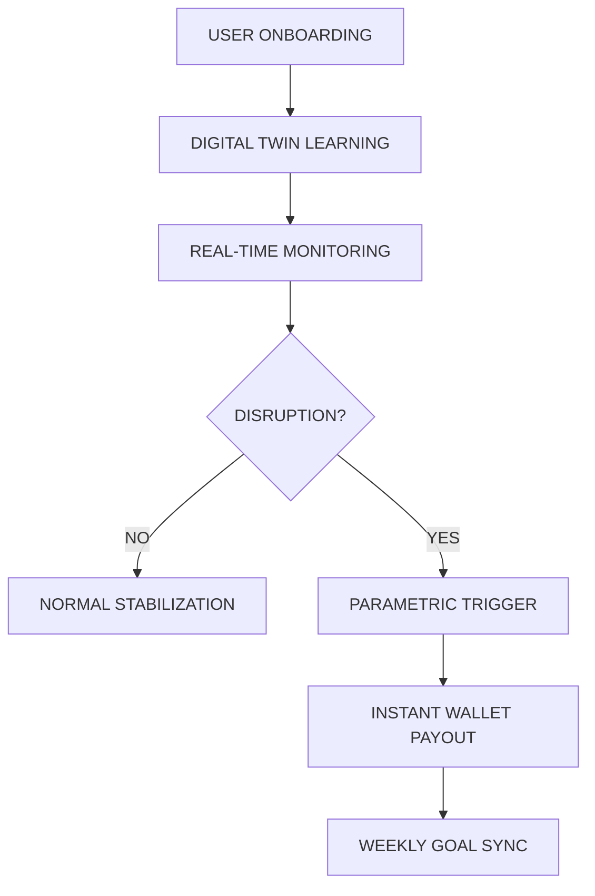

# IncomeOS

<div align="center">
  
  
  <br />
  
  <h3>ADAPTIVE INCOME INTELLIGENCE</h3>
  <p><strong>Predict. Prevent. Stabilize.</strong></p>
  
  <p align="center">
    <a href="#-the-problem">Problem</a> • 
    <a href="#-workflow">Workflow</a> • 
    <a href="#-intelligence">AI Layer</a> • 
    <a href="#-stability-wallet">Wallet</a>
  </p>
  
  <hr />
  <br />
</div>

> [!IMPORTANT]
> **SYSTEM STATUS: OPTIMIZING**
> The Intelligence Engine is currently simulating 4.2k active geofences in the Chennai-Bangalore corridor.

---

## 1. ⚡ The Shift in Thinking

Traditional systems are reactive. They wait for a loss, then process a claim. **IncomeOS is predictive.** We don't just calculate risk; we actively mitigate it before it happens.

| FEATURE | TRADITIONAL | INCOMEOS |
| :--- | :--- | :--- |
| **Logic** | Reactive (Loss-based) | Predictive (Data-based) |
| **Speed** | 3 - 30 Days Payout | Instant Parametric Trigger |
| **Intelligence** | None | Real-time Digital Twin Simulation |
| **Goal** | Compensation | Prevention + Stability |

---

## 2. 🗺️ Workforce Intelligence

### **RAVI | DELIVERY PARTNER | CHENNAI S3**
Ravi navigates one of the most volatile urban climates. Heatwaves and monsoons directly dictate his survival.

<details open>
<summary><b>PROTOCOL: RAINFALL DETECTED</b></summary>
<br />
Trigger: >5mm/hr in Central Zone. Ravi stops for safety. Stablizer auto-compensates ₹240 gap instantly to his wallet.
</details>

<details>
<summary><b>PROTOCOL: HEATWAVE INDEX</b></summary>
<br />
Trigger: Temperature >42°C. Productivity drops. Shift recommendation pushed to Ravi for shaded "Profit Clusters".
</details>

---

## 3. 🌀 System Workflow



---

## 4. 🧠 Core Engines

### **Predictive Digital Twin**

A real-time shadow simulation of your earning potential. Using historical data and current demand, it calculates exactly what you *should* be earning every minute.

### **Thermal Heat Mapping**

Multi-layered model analyzing weather APIs, thermal traffic maps, and historical disruption data to assign a "Stability Score" to every zone in the city.

---

## 5. 🛠️ Tech Architecture

```
[ FRONTEND HUD ]
      ↓  (Framer Motion / Next.js 15)
[ API GATEWAY ]
      ↓  (FastAPI Intelligence Layer)
[ DATA SYNC ] ↔ [ WEATHER / MAPS / PLATFORMS ]
      ↓  (Parametric Logic)
[ STABILIZER WALLET ] 
```

---

## 6. 🚀 Product Philosophy

**Not Insurance. Intelligence.**
Traditional insurance wants you to fail so they can pay. IncomeOS wants you to succeed so we can stabilize.

**Not Reactive. Predictive.**
We don't wait for your bank account to hit zero. We see the rain coming and move you—or pay you—before it happens.

---

<div align="center">
  <br />
  
  <p><em>"IncomeOS transforms uncertainty into a controlled, intelligent system."</em></p>
  <hr />
  <p>Built with ❤️ for the Gig Economy by Kaveen Krithik</p>
</div>
